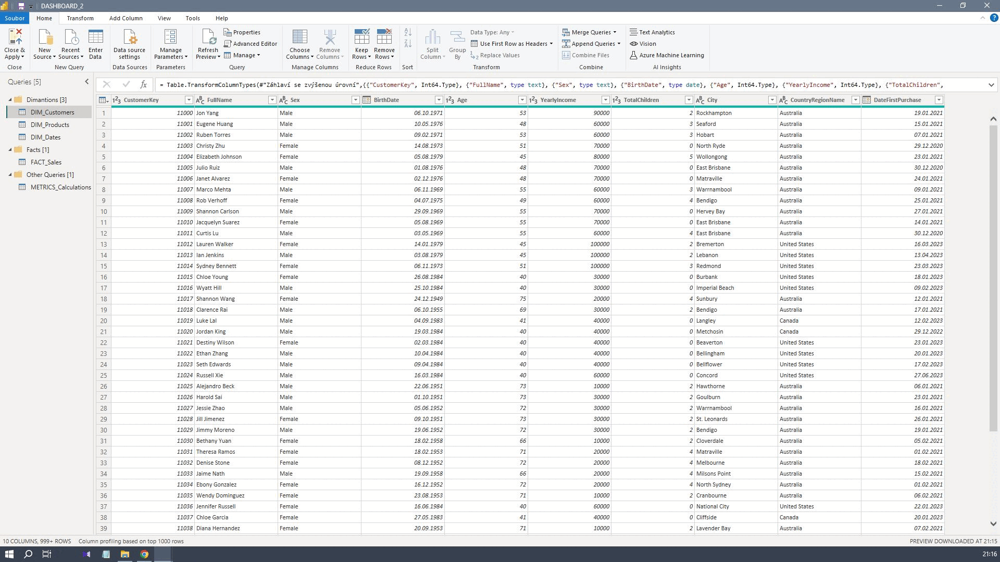

# Arkadii Makhmatov - Data Analyst Portfolio

# [Project 1: Customer Segmentation and Lifetime Value Analysis based on sample DB]

## Project Overview

The objective of this project is to extract relevant data from the AdventureWorksDW2019 database and create an interactive dashboard that provides insights into customer segments and their lifetime value (CLV). This dashboard can be usefull for marketing and customer relationship management (CRM) teams to develop targeted marketing campaigns and strategies to increase customer lifetime value.

## Problem Statement

AdventureWorks, a global bicycle manufacturer and retailer, aims to understand its customer base better by segmenting customers and analyzing their lifetime value. This analysis will help AdventureWorks tailor its marketing strategies, improve customer retention, and maximize revenue. The company has a SQL Server database backup (AdventureWorksDW2019.bak) containing historical sales data, customer information, product details, and other relevant data.

## Steps Followed

1. **Data Extraction**
   - Extracted customer, product, sales, and calendar data from the AdventureWorksDW2019 database using SQL.

2. **KPI Calculation**
   - Calculated key performance indicators (KPIs) such as customer lifetime value (CLV), average purchase value, and purchase frequency.

3. **Data Loading and Modeling in Power BI**
   - Loaded the cleaned data into Power BI.
   - Created data models to establish relationships between different data tables.

4. **Dashboard Creation**
   - Designed and developed an interactive dashboard in Power BI.
   - Included overviews, filters, graphs, and analyses to provide insights into customer segments, sales and their lifetime value.

## Key Features of the Dashboard

- **Interactive Filters**: Ability to filter data based on various parameters such as time period, product category, and customer segment.
- **Customer Segmentation**: Visual representation of different customer segments based on demographics.
- **Lifetime Value Analysis**: Insights into the lifetime value of customers, helping identify high-value customer segments.
- **Graphs and Visualizations**: Bar charts, line graphs, and pie charts to represent data trends and distributions effectively.

## Technologies Used

- **SQL**: For data extraction and transformation.
- **Power BI**: For data visualization and dashboard creation.
- **AdventureWorksDW2019**: Sample database used for analysis.

## Conclusion

This project demonstrates the application of SQL and Power BI to extract, clean, and visualize data, providing actionable insights for marketing and CRM teams. The interactive dashboard developed in this project helps AdventureWorks understand its customer base better and tailor its marketing strategies to maximize customer lifetime value.

